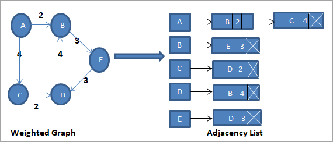

# Advanced Programming - HW5
<p  align="center"> <b>Homework 5 - Spring 2023 Semester <br> Deadline: Wednesday khordad 3st - 11:59 pm</b> </p>

## Outline
A graph is a non-linear data structure. A graph can be defined as a collection of Nodes which are also called *vertices* and *edges* that connect two or more vertices.

In this homework we want to implement graph data structure. We use the adjacency list for the linked representation of the graph. The adjacency list representation maintains each node of the graph and a link to the nodes that are adjacent to this node. When we traverse all the adjacent nodes, we set the next pointer to null at the end of the list.


## Graph class
```cpp
template<typename T>
class Graph
{
public:
    // TODO: constructors and methods
private:
    class Node
    {
    public:
        T value{};
        Node* next{};
        //TODO: constructors and methods
    };
    std::vector<Node*> head;
};
```
### Functions
- ` void addVertex(const T& v)`: get T and add to graph.
- `void addEdge(const T& v1, const T& v2, int a,  std::function<bool(T, T)> func)`: get two nodes and weight to add edge from v1 to v2. Use func to search in the graph and find(set default function to it).If edge exist, replace it with new weight.
- `int getNumEdges()`: The number of edges in the graph.
- `vector<T> getNeighbors(T vertex, std::function<bool(T, T)> func)`: Get the list of neighbors of a vertex(set default function to it).
- `bool isConnected(T source, T destination, std::function<bool(T, T)> func)`: Check if two vertices are connected(set default function to it).
- `vector<T> findShortestPath(T source, T destination, std::function<bool(T, T)> func)`: Find the shortest path between two vertices(set default function to it).
- `int getNumConnectedComponents()`:Get the number of connected components in the graph.
- `void bfs(int vertex, vector<bool>& visited)`: implement Breadth-first search (BFS)
- `vector<T> topologicalSort()`: [_link_](https://en.wikipedia.org/wiki/Topological_sorting#:~:text=In%20computer%20science%2C%20a%20topological,before%20v%20in%20the%20ordering.)

## part 2
Implement a binary search tree that can store int data that can be compared using the less-than operator. The program should also be able to perform the following operations on the tree:

- Insert a new node into the tree
- Delete a node from the tree
- Find a node in the tree
- Print the contents of the tree in sorted order

```cpp
struct Node {
    int value;
    Node* left;
    Node* right;

    Node(int value) {
        this->value = value;
        left = nullptr;
        right = nullptr;
    }
};

Node* insert(Node* root, int value) {
}

void deleteNode(Node* root, int value) {
}

Node* find(Node* root, int value) {
}

void printInOrder(Node* root) {
}
```
<br/>
<p  align="center"> <b>GOOD LUCK</b> </p>